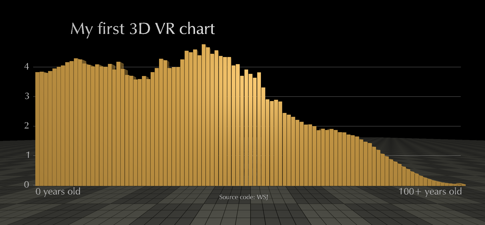

# Building VR journalism

Virtual reality is in tons of conversations of journalism but very few media have really tested this technology.

In this session we will review some of the examples out of there, take a look to some of the most interesting tutorials and will put our hands on an interesting tutorial during the session.

## First steps: What you will learn

### The core of VR

* [WebGL](https://www.chromeexperiments.com/webgl): a web technology that brings hardware- accelerated 3D graphics to the browser without installing additional software.

* [Three.js](https://threejs.org): A JavaScript 3D Library which makes WebGL simpler.

### You will put your hands on...

* Terminal: Don't be afraid. We will start a localhost from the Terminal.

* Python: We will build our local server in Python. You can do it also with MAMP, xxx, xxx

* HTML&CSS: To build the structure in which we will write our Three.js script.

* D3: in case you follow vr charts tutorial.

## Before starting with Three.js and WebGL
We have to start up a webserver to serve our page and assets.

Open the terminal on your computer (Bash in windows) and navigate to the folder in which you'll build this tutorial. Enter the following at the prompt:

```bash
$ cd /data/vr_interactives # or the folder where you want to build your vr project
$ python -m SimpleHTTPServer
```

If you're using Python 3, you have to run http.server instead.

```bash
$ cd /eijc-journocoders  # or the folder where you want to build your vr project
python3 -m http.server
```

To check that everything is working, go to your local server 8000 [http://localhost:8000/three-demo.html](http://localhost:8000/three-demo.html). That page will be blank for now.

## The tutorials

### LA TIMES vr interactive three.js

In this tutorial you'll learn how La Times used NASA satellite imagery and elevation data to create a 3-D rendering of the [Gale Crater](http://graphics.latimes.com/mars-gale-crater-vr/) on Mars.

To follow the tutorial go to [their repository](https://github.com/datadesk/vr-interactives-three-js).

### WSJ virtual reality data visualization

In this tutorial you can learn how to create virtual reality charts. It is written by Roger Kenny, an interactive designer at the Wall Street Journal.

To follow the tutorial go to [this article](http://www.storybench.org/how-to-make-a-simple-virtual-reality-data-visualization/) .

You can also check the code commented by Journocoders below.

### Building VR with A-frame
A-frame is a web framework for building virtual reality experiences. Simpler than the ones above, another way to start in VR.

To follow the tutorial go to [this presentation](https://belen-albeza.github.io/building-vr/#7)

## Today's tutorial

We are going to follow the WSJ's tutorial to build our VR example.

You can download the contents for the tutorial [here](https://drive.google.com/file/d/0B4pA3-IiW9WUaGxxN00zNlBaeGM/view?usp=sharing).

First of all, these are the assets we need to start building it:
* [Three.js](https://threejs.org/docs/index.html#manual/introduction/Creating-a-scene)
* [OrbitControls](https://www.npmjs.com/package/orbit-controls)
* [Typeface](http://blog.andrewray.me/creating-a-3d-font-in-three-js/)
* [D3](https://d3js.org)

```bash

<script src="js/third-party/threejs/three.js"></script>
<script src="js/third-party/threejs/OrbitControls.js"></script>
<script src="js/optimer_bold.typeface.js"></script>
<script src="js/optimer_regular.typeface.js"></script>
<script src="http://d3js.org/d3.v3.min.js" charset="utf-8"></script>

```

In three.js, we build the 3D environment in which we will insert the code.

```bash

<script>

// First step: fix all the variables
  var camera, scene, renderer;
  var effect, controls;
  var element, container;

  var clock = new THREE.Clock();

  init();
  animate();

  //

  function init() {
    renderer = new THREE.WebGLRenderer();
    element = renderer.domElement;
    container = document.getElementById('container');
    container.appendChild(element);

    // effect = new THREE.StereoEffect(renderer);

    scene = new THREE.Scene();

    camera = new THREE.PerspectiveCamera(90, 1, 0.001, 700);
    camera.position.set(0, 15, 10);
    scene.add(camera);

    controls = new THREE.OrbitControls(camera, element);
    controls.rotateUp(Math.PI / 4);
    controls.target.set(
      camera.position.x,
      camera.position.y + 0.1,
      camera.position.z - 0.1
    );
    controls.noZoom = true;
    controls.noPan = true;

    function setOrientationControls(e) {
      if (!e.alpha) {
        return;
      }

      controls = new THREE.DeviceOrientationControls(camera, true);
      controls.connect();
      controls.update();

      element.addEventListener('click', fullscreen, false);

      window.removeEventListener('deviceorientation', setOrientationControls, true);
    }
    window.addEventListener('deviceorientation', setOrientationControls, true);

    var light = new THREE.HemisphereLight(0x777777, 0x000000, 0.6);
    scene.add(light);

    // with this var
    var texture = THREE.ImageUtils.loadTexture(
      'textures/patterns/yellowchecker.png'
    );
    texture.wrapS = THREE.RepeatWrapping;
    texture.wrapT = THREE.RepeatWrapping;
    texture.repeat = new THREE.Vector2(50, 50);
    texture.anisotropy = renderer.getMaxAnisotropy();

    spectexture = THREE.ImageUtils.loadTexture(
      'textures/patterns/blacklinegrid.png'
    );
    spectexture.wrapS = THREE.RepeatWrapping;
    spectexture.wrapT = THREE.RepeatWrapping;
    spectexture.repeat = new THREE.Vector2(50, 50);
    spectexture.anisotropy = renderer.getMaxAnisotropy();

    var material = new THREE.MeshPhongMaterial({
      color: 0xffffff,
      specular: 0xffffff,
      shininess: 5,
      shading: THREE.FlatShading,
      map: texture,
      specularMap: spectexture
    });

    var geometry = new THREE.PlaneGeometry(1000, 1000);

    var mesh = new THREE.Mesh(geometry, material);
    mesh.rotation.x = -Math.PI / 2;
    scene.add(mesh);

    window.addEventListener('resize', resize, false);
    setTimeout(resize, 1);

    /////// D3 CONTENT STARTS HERE ////////

    /////// D3 CONTENT FINISHES HERE ////////

  }

  function resize() {
    var width = container.offsetWidth;
    var height = container.offsetHeight;

    camera.aspect = width / height;
    camera.updateProjectionMatrix();

    renderer.setSize(width, height);
    // effect.setSize(width, height);
  }

  function update(dt) {
    resize();

    camera.updateProjectionMatrix();

    controls.update(dt);
  }

  function render(dt) {
    renderer.render(scene, camera);
  }

  function animate(t) {
    requestAnimationFrame(animate);

    update(clock.getDelta());
    render(clock.getDelta());
  }

  function fullscreen() {
    if (container.requestFullscreen) {
      container.requestFullscreen();
    } else if (container.msRequestFullscreen) {
      container.msRequestFullscreen();
    } else if (container.mozRequestFullScreen) {
      container.mozRequestFullScreen();
    } else if (container.webkitRequestFullscreen) {
      container.webkitRequestFullscreen();
    }
  }

  function createType(options) {
    var height = options.height || 0.1,
        size = options.size || 3,
        material = new THREE.MeshFaceMaterial( [
          new THREE.MeshPhongMaterial( { color: 0xffffff, shading: THREE.FlatShading } ), // front
          new THREE.MeshPhongMaterial( { color: 0xffffff, shading: THREE.SmoothShading } ) // side
        ] ),
        text = options.text || "Test";

    var textGeo = new THREE.TextGeometry( text, {

        size: size,
        height: height,
        curveSegments: 4,

        font: "optimer",
        weight: "normal",
        style: "normal",

        bevelEnabled: false,

        material: 0,
        extrudeMaterial: 1

      });

      textGeo.computeBoundingBox();

      var textMesh1 = new THREE.Mesh( textGeo, material );

      return textMesh1;
  }
</script>

```

Yes, it's too long, but do not panic, you only have to have an idea of it.

After, that we build our D3 graphic. Take a look of the code commented:

```

/////// D3 CONTENT STARTS HERE ////////

 // First of all, regarding D3, charge your data. In this WSJ's journal example we are working with US population data
 d3.csv('data.csv', population, function(data){
   xscale.domain([0, data.length - 1]);
   yscale.domain([0, d3.max(data, function(d){ return d.all; })]);


   // Set a variable to control the column width
   var columnwidth = (chartwidth / data.length);
   columnwidth -= columnwidth * 0.1;

   // Create a phong material which will be shared by all columns, and fill it with a blue color
   // WTF is Phong? Phong shading refers to an interpolation technique for surface shading in 3D computer graphics.
   var columnmaterial = new THREE.MeshPhongMaterial({
     color: "#0000ff",
     emissive: "#000000"
   });

   // Now we’ll iterate over our data and create a new 3D box for each point. We’ll use the scales we set up earlier to set the height of each and its x position and y position.

   data.forEach(function(d, i, a){
     var colheight = yscale(d.all);
     var columngeo = new THREE.BoxGeometry(columnwidth, colheight, columnwidth);
     var columnmesh = new THREE.Mesh(columngeo, columnmaterial);
     columnmesh.position.set(xscale(i), colheight/2 + marginbottom, 0); //Box geometry is positioned at its’ center, so we need to move it up by half the height

     scene.add(columnmesh);
   });

   yscale.ticks(5).forEach(function(t, i, a){

     //Draw labels in your chart
     var label = createType({text: "" + (t/1000000), size: 1.5});
     var xOffset = ( label.geometry.boundingBox.max.x - label.geometry.boundingBox.min.x );
     label.position.set(-chartwidth/2 - xOffset - 2.5, yscale(t) + marginbottom - 0.5, 0);
     scene.add(label);

     //Draw lines in your chart
     var lineGeometry = new THREE.Geometry();
     var vertArray = lineGeometry.vertices;
     vertArray.push( new THREE.Vector3(-chartwidth/2 - 1.5, yscale(t) + marginbottom, 0),
                     new THREE.Vector3(chartwidth/2, yscale(t) + marginbottom, 0) );
     lineGeometry.computeLineDistances();
     var lineMaterial = new THREE.LineBasicMaterial( { color: 0xaaaaaa } );
     var line = new THREE.Line( lineGeometry, lineMaterial );
     scene.add(line);

   });

 });

 // From the dataset 'data.csv' we have loaded before, we build a data transformation function and select male, female and all
 function population(d) {
   d.all = +d.all;
   d.male = +d.male;
   d.female = +d.female;
   return d;
 }

 // This var fixes the title of your chart in D3
 var title = createType({text: "U.S. Population By Age, January 2000 in millions"});
 title.position.set(-chartwidth/2, chartheight + 10, -5);
 scene.add(title);

 // Do you want to add any explanatory note to your x axis? Go ahead (0,0)
 var xzerolabel = createType({text: "0 years old", size: 1.5});
 xzerolabel.position.set(-chartwidth/2 - 1, 2, 0);
 scene.add(xzerolabel);

 // Add an extra explanatory mark to (100,0) position
 var x100label = createType({text: "100+ years old", size: 1.5});
 var xOffset = ( x100label.geometry.boundingBox.max.x - x100label.geometry.boundingBox.min.x );
 x100label.position.set(chartwidth/2 - xOffset, 2, 0);
 scene.add(x100label);

 // Add the source of your data in the graphic
 var srctext = createType({text: "Sauce: U.S. Census", size: 1});
 var xOffset = 0.5 * ( x100label.geometry.boundingBox.max.x - x100label.geometry.boundingBox.min.x );
 srctext.position.set(0 - xOffset, 1, 0);
 scene.add(srctext);

 /////// D3 CONTENT FINISHES HERE ////////

```

Voilà! You should see something like this at :


